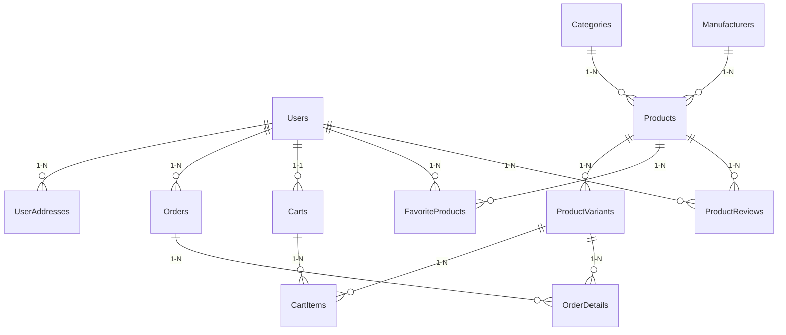

Edited vandap.md
Edited luonghoatdong.md
Viewed luonghoatdong.md:74-91

Dưới đây là tài liệu chi tiết, toàn diện nhất về toàn bộ dự án **BaseCore** (Backend, Frontend, Cơ sở dữ liệu và Luồng xử lý chi tiết) để bạn chuẩn bị cho kỳ thi vấn đáp:

---

## 📁 1. Cấu trúc Thư mục và Các Thành phần Dự án

Mã nguồn được tổ chức thành các thư mục chức năng rõ ràng giữa Frontend và Backend:

```text
BaseCore/
├── BaseCore.ApiGateway/         # Ocelot Gateway (Port 5000)
├── BaseCore.AuthService/        # Dịch vụ xác thực và phân quyền (Port 5003)
├── BaseCore.APIService/         # Dịch vụ xử lý nghiệp vụ bán hàng (Port 5001)
├── BaseCore.Entities/           # Class Library chứa các Entity Model của Database
├── BaseCore.Repository/         # Class Library chứa DbContext, Migration và Repository EF Core
├── BaseCore.Services/           # Class Library xử lý Business Logic dùng chung
├── BaseCore.Common/             # Thư viện dùng chung (JWT Helpers, Constants)
├── BaseCore.DTO/                # Định nghĩa các Data Transfer Object
├── BaseCore.WebClient/          # Frontend React SPA + Vite
└── database/                    # File database backup và kịch bản SQL
```

---

## 🗄️ 2. Chi tiết Cơ sở Dữ liệu (Database Schema)

Dữ liệu được tổ chức tập trung trên **SQL Server** thông qua `SQLServerDbContext.cs` (`BaseCore.Repository`). Các bảng được phân nhóm theo 3 Schema chính:



### A. Schema `auth` (Xác thực & Người dùng)

- **`Users`**: Lưu thông tin tài khoản (`Id`, `Email`, `Password` dạng PlainText, `Name`, `Phone`, `Role`, `Status`).
- **`UserAddresses`**: Quản lý địa chỉ giao hàng của User (`Id`, `UserId`, `AddressLine`, `City`, `IsDefault`).
- **`Roles`, `UserRoles`, `GroupRoleAgencies`**: Cấu hình phân quyền hệ thống.

### B. Schema `catalog` (Danh mục & Sản phẩm)

- **`Categories`**: Danh mục sản phẩm (`Id`, `Name`, `Description`, `ParentCategoryId`).
- **`Manufacturers`**: Nhà sản xuất sản phẩm (`Id`, `Name`, `Description`).
- **`Products`**: Thông tin sản phẩm chung (`Id`, `Name`, `Description`, `Price`, `OldPrice`, `CategoryId`, `ManufacturerId`).
- **`ProductVariants`**: Các biến thể sản phẩm theo thuộc tính như Size/Màu sắc (`Id`, `ProductId`, `Name`, `Sku`, `Price`, `StockQuantity`).
- **`FavoriteProducts`**: Danh sách sản phẩm yêu thích (Wishlist) của User (`UserId`, `ProductId`).
- **`ProductReviews`**: Các đánh giá sao (`Rating`) và bình luận của khách hàng về sản phẩm.

### C. Schema `orders` (Giỏ hàng & Đơn hàng)

- **`Carts`**: Thông tin giỏ hàng của người dùng (`Id`, `UserId`, `CreatedDate`).
- **`CartItems`**: Chi tiết các sản phẩm trong giỏ (`Id`, `CartId`, `ProductVariantId`, `Quantity`).
- **`Orders`**: Hóa đơn đặt hàng (`Id`, `OrderCode`, `UserId`, `OrderSubtotal`, `OrderTotal`, `OrderStatus`, `PaymentStatus`, `ShippingStatus`, `Created`).
- **`OrderDetails`**: Chi tiết sản phẩm đã mua (`Id`, `OrderId`, `ProductVariantId`, `Quantity`, `UnitPrice`, `ItemDiscount`).

---

## 🛠️ 3. Chi tiết Kỹ thuật tại Backend (.NET 8/9)

### A. API Gateway (Ocelot)

File cấu hình `ocelot.json` định nghĩa các luật định tuyến.

- **Upstream** (Client gọi lên): Ví dụ `http://localhost:5000/api/products`
- **Downstream** (Gateway gọi nội bộ): Ví dụ `http://localhost:5001/api/products`
- **CORS**: Gateway cấu hình chính sách cho phép Frontend truy cập, tránh lỗi bảo mật chéo nguồn.

### B. AuthService (Port 5003)

- Xử lý API đăng ký `/api/auth/register` và đăng nhập `/api/auth/login`.
- Khi đăng nhập thành công, nó sử dụng thư viện `System.IdentityModel.Tokens.Jwt` để tạo chuỗi mã hóa JWT:
  ```csharp
  var tokenHandler = new JwtSecurityTokenHandler();
  var tokenDescriptor = new SecurityTokenDescriptor {
      Subject = new ClaimsIdentity(new[] {
          new Claim(ClaimTypes.NameIdentifier, user.Id.ToString()),
          new Claim(ClaimTypes.Email, user.Email),
          new Claim(ClaimTypes.Role, user.Role) // Lưu quyền (admin/customer)
      }),
      Expires = DateTime.UtcNow.AddDays(7),
      SigningCredentials = new SigningCredentials(new SymmetricSecurityKey(key), SecurityAlgorithms.HmacSha256Signature)
  };
  ```

### C. APIService (Port 5001)

- Chứa toàn bộ controllers quản trị và bán hàng.
- Sử dụng **EF Core** với **SQL Server** thông qua cơ chế Dependency Injection.
- Ví dụ luồng truy xuất trong `ProductsController.cs`:
  ```csharp
  [HttpGet]
  public async Task<IActionResult> GetAll() {
      var products = await _productRepository.GetAllAsync();
      return Ok(products);
  }
  ```

---

## 💻 4. Chi tiết Kỹ thuật tại Frontend (ReactJS)

### A. Quản lý trạng thái bằng Context API

Frontend chia sẻ dữ liệu chung mà không cần truyền prop thủ công qua các Providers:

- `AuthContext.jsx`: Theo dõi trạng thái đăng nhập, lưu thông tin User và Token.
- `CartContext.jsx`: Đồng bộ số lượng mặt hàng trong giỏ lên header thanh điều hướng.
- `FavoriteContext.jsx`: Quản lý danh sách sản phẩm yêu thích của khách hàng.

### B. Route Guards (`ProtectedRoute.jsx`)

Bảo vệ các trang admin bằng cách chặn truy cập trái phép:

```javascript
const ProtectedRoute = ({ children, allowedRoles }) => {
  const { user, token } = useAuth();
  if (!token) return <Navigate to="/login" />;
  if (allowedRoles && !allowedRoles.includes(user.role)) {
    return <Navigate to="/" />; // Không đủ quyền thì về trang chủ
  }
  return children;
};
```

Sử dụng trong `App.jsx`:

```javascript
<Route
  path="/admin/*"
  element={
    <ProtectedRoute allowedRoles={["admin"]}>
      <AdminLayout />
    </ProtectedRoute>
  }
/>
```

---

## 🔄 5. Luồng xử lý chi tiết: Từ Click chuột đến Database

Dưới đây là ví dụ luồng chi tiết của chức năng **Đặt hàng (Checkout)**:

```text
[Khách hàng] Click nút "Đặt Hàng" (Checkout.jsx)
      │
      ▼
[React App] Đóng gói dữ liệu (Địa chỉ, Voucher, Danh sách sản phẩm)
      │
      ▼
[Axios Client] Gửi POST request kèm JWT Token tới cổng Gateway (localhost:5000/api/cart/checkout)
      │
      ▼
[Ocelot Gateway]
   1. Nhận request, xác thực cấu hình định tuyến.
   2. Chuyển tiếp request đến APIService (localhost:5001/api/cart/checkout).
      │
      ▼
[APIService (CartController)]
   1. Đọc JWT Claim để xác định UserId.
   2. Khởi tạo một Database Transaction (Atomic).
   3. Kiểm tra số lượng tồn kho từng sản phẩm trong bảng [ProductVariants].
   4. Tính toán tổng số tiền (Tổng phụ, Thuế, giảm giá từ Coupon).
   5. Thêm bản ghi mới vào bảng [Orders].
   6. Lặp qua các sản phẩm trong giỏ để thêm vào bảng [OrderDetails].
   7. Trừ số lượng tồn kho tương ứng của sản phẩm.
   8. Xóa các sản phẩm trong giỏ hàng hiện tại của User ở bảng [CartItems].
   9. Nếu có lỗi phát sinh (ví dụ: Hết hàng giữa chừng) -> Rollback Transaction.
  10. Nếu thành công -> Commit Transaction và trả về mã OrderCode.
      │
      ▼
[SQL Server Database] Ghi và cập nhật vĩnh viễn các bảng dữ liệu.
      │
      ▼
[React App] Nhận mã OrderCode thành công -> Hiển thị màn hình chúc mừng đặt hàng thành công.
```

---

## 🎓 6. Các từ khóa "Đắt giá" nên nói khi Thi Vấn đáp

Để thầy cô biết bạn có kiến thức chuyên môn sâu, hãy đưa các từ khóa này vào câu trả lời:

1.  **Loose Coupling (Liên kết lỏng lẻo):** Việc tách Gateway, AuthService và APIService giúp hệ thống không bị ảnh hưởng dây chuyền khi một dịch vụ gặp sự cố bảo trì.
2.  **Data Persistence (Bền vững dữ liệu):** Lưu giữ các thông tin sản phẩm tại thời điểm mua trong `OrderDetail` thay vì chỉ tham chiếu sang bảng `Product` đề phòng trường hợp tương lai sản phẩm thay đổi thông tin.
3.  **Atomic Transaction (Giao dịch nguyên tử):** Đảm bảo tính nhất quán dữ liệu ở luồng thanh toán (hoặc thành công toàn bộ, hoặc thất bại toàn bộ).
4.  **CORS (Cross-Origin Resource Sharing):** Chính sách an toàn được xử lý ở Gateway cho phép Frontend ở domain khác gọi API Backend.
5.  **Route Guard:** Kỹ thuật chặn bảo vệ giao diện phía Client thông qua React Router DOM.
