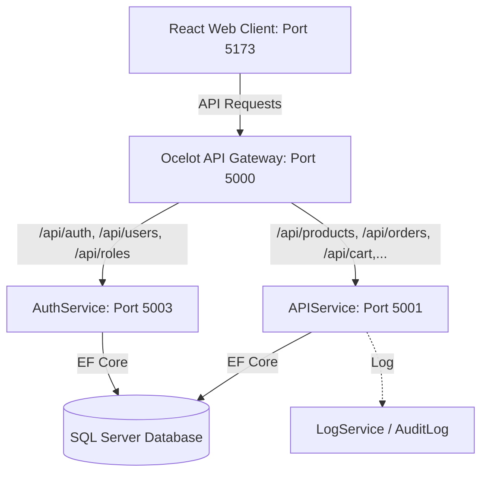

Dưới đây là giải thích chi tiết về kiến trúc tổng quan, các dịch vụ thành phần và các luồng hoạt động chính của dự án **BaseCore E-Commerce System**:

---

## I. Tổng quan Kiến trúc Hệ thống

Hệ thống được thiết kế theo kiến trúc **Microservices / SOA (Service-Oriented Architecture)** ở phía Backend phối hợp với SPA (Single Page Application) ở phía Frontend.

### 1. Phân rã các dự án Backend (.NET Core)

- **`BaseCore.ApiGateway` (Port 5000):** Sử dụng thư viện **Ocelot** cấu hình qua file `ocelot.json`. Đóng vai trò làm ngõ vào duy nhất (Single Entry Point), định tuyến các request từ Frontend tới các microservices đích và xử lý CORS.
- **`BaseCore.AuthService` (Port 5003):** Chịu trách nhiệm quản lý xác thực (Authentication) và phân quyền (Authorization). Xử lý đăng ký, đăng nhập, phát hành mã JWT (JSON Web Token), và quản lý tài khoản người dùng (`User`, `Role`).
- **`BaseCore.APIService` (Port 5001):** Dịch vụ chứa toàn bộ Business Logic của hệ thống thương mại điện tử như sản phẩm (`Products`), danh mục (`Categories`), giỏ hàng (`Cart`), đơn hàng (`Orders`), thuộc tính thanh toán (`CheckoutAttributes`), thuộc tính sản phẩm (`SpecificationAttributes`), coupon giảm giá, và đánh giá phản hồi (`Reviews`).
- **`BaseCore.LogService` & `BaseCore.AuditLog`:** Lưu trữ và ghi vết nhật ký hoạt động hệ thống (Action logs) cùng các lỗi phát sinh (Error logs) phục vụ kiểm toán và xử lý sự cố.
- **Các thư viện dùng chung (Shared Class Libraries):**
  - `BaseCore.Entities`: Định nghĩa các thực thể dữ liệu ánh xạ xuống Database (như `Product`, `Order`, `User`, `CartItem`, v.v.).
  - `BaseCore.Repository`: Triển khai các lớp truy xuất dữ liệu (Data Access Layer - DAL) sử dụng Entity Framework Core phối hợp với SQL Server thông qua `SQLServerDbContext` và cơ chế Repository Pattern.
  - `BaseCore.Services` & `BaseCore.Common`: Cung cấp các helper, tiện ích dùng chung và các định nghĩa kiểu dữ liệu DTO.

### 2. Frontend (`BaseCore.WebClient`)

- Được xây dựng bằng **React + Vite**, sử dụng giao diện **Bootstrap 5** và quản lý API tập trung qua **Axios** (`src/services/api.js`).
- Cơ chế đính kèm tự động Token JWT qua Axios request interceptor cho các request yêu cầu xác thực.
- Tích hợp xử lý tự động khi gặp lỗi kết nối (tự động retry tối đa 2 lần với các request dạng `GET` gặp lỗi `>= 500`) và chuyển hướng sang trang đăng nhập nếu token hết hạn (lỗi `401 Unauthorized`).

---

## II. Luồng hoạt động chính của hệ thống (Workflows)

### 1. Luồng Xác thực & Phân quyền (Authentication & Authorization Flow)

1.  **Đăng nhập/Đăng ký:** Người dùng gửi thông tin từ màn hình `Login.jsx` / `Register.jsx`. Request gửi tới cổng Gateway (`Port 5000/api/auth/login`) và định tuyến đến `AuthService (Port 5003)`.
2.  **Cấp phát Token:** `AuthService` kiểm tra credentials dưới Database. Nếu hợp lệ, dịch vụ tạo mã JWT chứa các Claims (Email, Role, Name) và trả lại client.
3.  **Lưu trữ & Sử dụng:** Client lưu trữ Token và thông tin User vào `localStorage`. Các request tiếp theo gửi qua Axios sẽ tự động gắn token vào header `Authorization: Bearer <token>`.
4.  **Kiểm tra quyền:** Tại `APIService`, các Endpoint được cấu hình với thuộc tính `[Authorize]` hoặc phân quyền cụ thể sẽ giải mã JWT để quyết định cho phép truy cập hay từ chối.

### 2. Luồng Mua hàng & Đặt hàng (Cart & Checkout Flow)

1.  **Xem & Chọn sản phẩm:** Khách hàng duyệt sản phẩm qua `Shop.jsx`, xem chi tiết ở `ProductDetail.jsx`.
2.  **Quản lý giỏ hàng:** Khi bấm thêm vào giỏ, client gửi yêu cầu đến `/api/cart/items` (`CartController.cs` thuộc `APIService`). Giỏ hàng của người dùng được lưu trữ tạm thời trong database.
3.  **Áp dụng Khuyến mại:** Tại trang `Checkout.jsx`, khách hàng có thể áp dụng mã giảm giá. Hệ thống gọi qua `/api/coupons/apply` để tính toán số tiền giảm trừ dựa trên giá trị đơn hàng hiện tại.
4.  **Đặt hàng:** Khi khách hàng bấm "Đặt hàng", thông tin giỏ hàng, địa chỉ giao hàng (`AddressesController`), cùng các tùy chọn bổ sung như gói quà (`CheckoutAttributes`) được đóng gói gửi tới `/api/orders` (`OrdersController.cs`).
5.  **Xử lý đơn hàng:** Hệ thống sẽ chuyển đổi thông tin giỏ hàng thành dữ liệu hóa đơn (`Order` và `OrderDetail`), làm sạch giỏ hàng của khách và chuyển trạng thái đơn hàng thành `Pending` (Chờ xử lý).

### 3. Luồng Thanh toán & Xử lý đơn hàng (Payment & Order Processing Flow)

1.  **Thanh toán:** Khách hàng có thể lựa chọn các phương thức thanh toán tại `Payments.jsx` (như COD, Chuyển khoản, VNPAY, MoMo, PayPal). Dự án tích hợp cơ chế mock xử lý giao dịch thực tế phục vụ demo UI/UX, cập nhật lịch sử giao dịch vào `localStorage` của client.
2.  **Quản lý phía Khách hàng:** Khách hàng theo dõi trạng thái đơn tại `MyOrders.jsx` (Chờ xử lý, Đang giao, Đã giao, Đã hủy).
3.  **Quản lý phía Quản trị viên (Admin):**
    - Admin truy cập trang `Orders.jsx` để duyệt đơn, đổi trạng thái vận chuyển, thanh toán hoặc hủy đơn.
    - Admin có thể xuất hóa đơn ra file PDF (sử dụng `jspdf` + `jspdf-autotable`) hoặc Excel (sử dụng `xlsx`).

### 4. Luồng Đổi trả sản phẩm (Return Merchandise Authorization - RMA Flow)

1.  **Yêu cầu đổi trả:** Đối với các đơn hàng đã hoàn thành (Delivered), khách hàng có thể tạo yêu cầu đổi trả hàng tại `Returns.jsx` (gửi lý do đổi trả, số lượng cần trả). Request gửi tới `/api/orders/{id}/request-return`.
2.  **Kiểm duyệt đổi trả:** Admin tiếp nhận yêu cầu đổi trả trên màn hình quản trị và đưa ra quyết định chấp nhận hoặc bác bỏ (`/api/orders/{id}/return-decision`). Trạng thái đơn hàng sẽ cập nhật tương ứng.

### 5. Luồng Giám sát Giỏ hàng Thời gian thực (Real-time Cart Monitoring Flow)

1.  **Hành vi khách hàng:** Trong lúc khách hàng thêm/sửa/xóa sản phẩm trong giỏ hàng.
2.  **Giám sát phía Admin:** Admin mở trang `CurrentCarts.jsx` để theo dõi các giỏ hàng đang hoạt động của tất cả người dùng (sản phẩm họ đang quan tâm, số lượng, tổng giá trị). Tính năng này giúp bộ phận bán hàng tối ưu chiến dịch tiếp thị hoặc hỗ trợ khách hàng kịp thời.

---

## III. Các Chức năng Quản trị (Admin Management)

Tại giao diện Admin, dự án cung cấp bộ công cụ quản lý toàn diện bao gồm:

- **Dashboard (`Dashboard.jsx`):** Biểu đồ trực quan hóa dữ liệu kinh doanh, lượng khách hàng, số lượng đơn hàng, tỷ lệ chuyển đổi và doanh thu theo thời gian.
- **Quản lý Catalog:** CRUD Danh mục (`Categories.jsx`), Sản phẩm (`Products.jsx`), Nhà sản xuất (`Manufacturers.jsx`), Thuộc tính kỹ thuật (`SpecificationAttributes.jsx`).
- **Quản lý User & Role (`Users.jsx`):** Cấp quyền truy cập dựa trên vai trò (Role-Based Access Control - RBAC).
- **Quản lý Đánh giá (`Reviews.jsx`):** Phê duyệt hoặc từ chối hiển thị các đánh giá sản phẩm của khách hàng trước khi xuất hiện trên trang chi tiết sản phẩm.
- **Báo cáo Doanh thu (`Revenue.jsx`):** Xem báo cáo và xuất báo cáo doanh số chi tiết.

---

Nếu bạn cần đi sâu vào mã nguồn của một luồng xử lý cụ thể nào (ví dụ: cách tính thuế, áp dụng mã giảm giá, hay logic định tuyến của API Gateway), hãy cho tôi biết.
