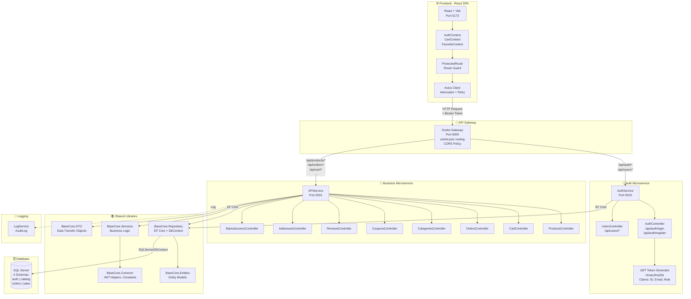
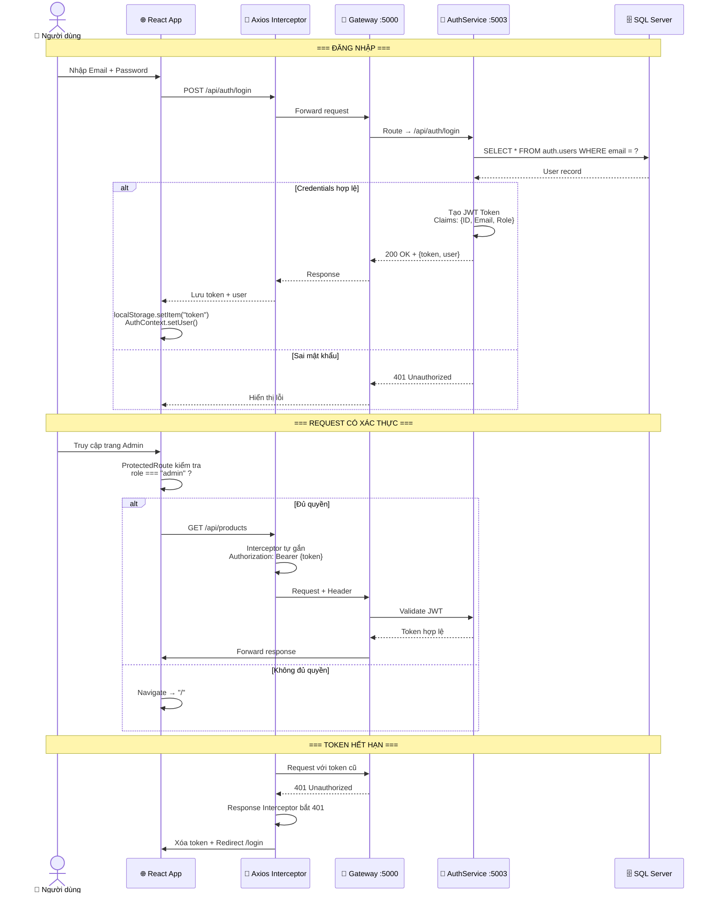
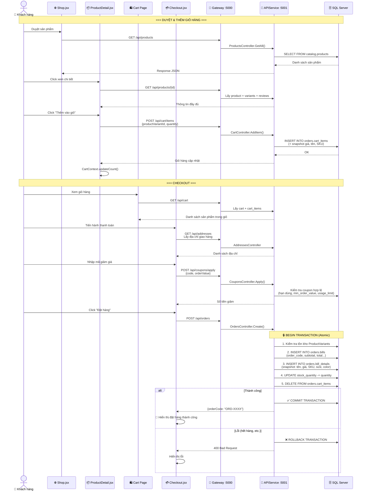
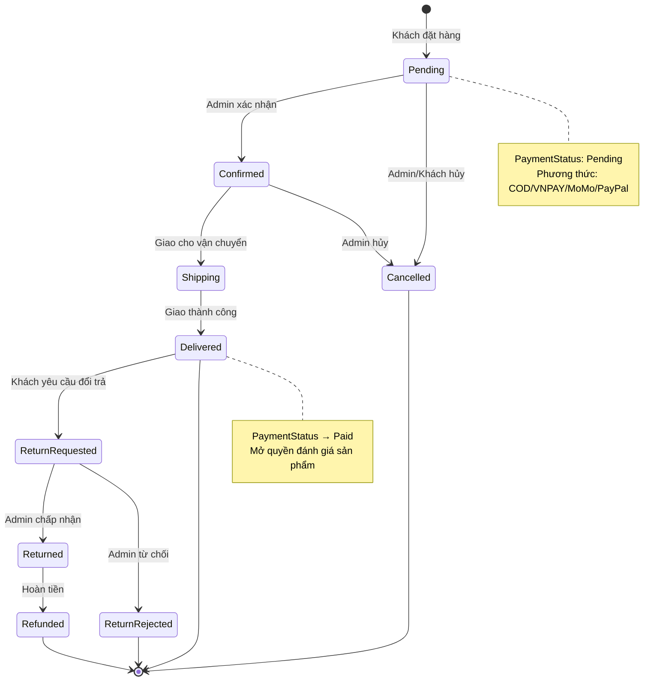
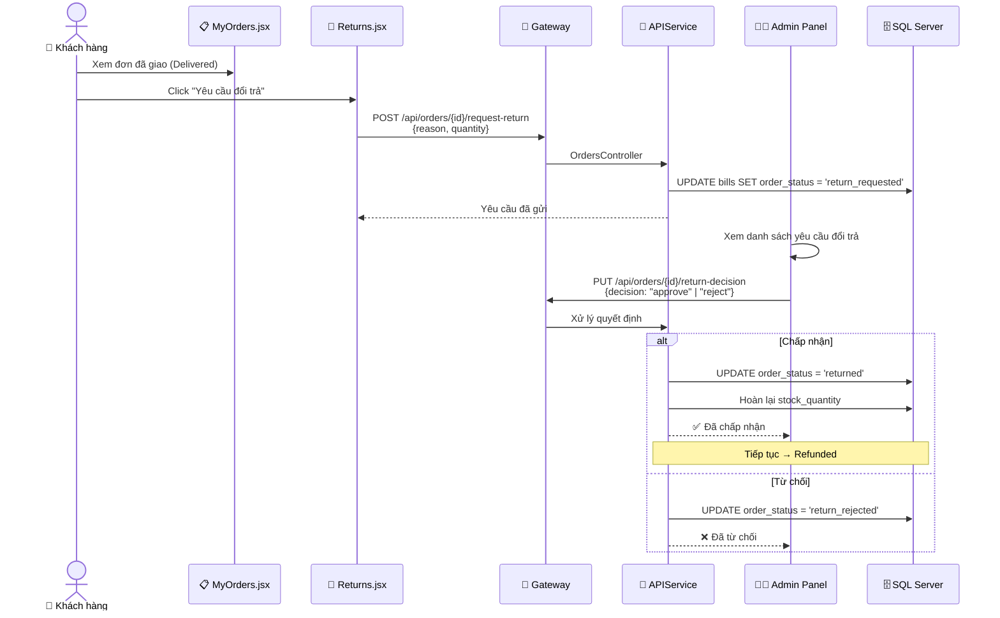
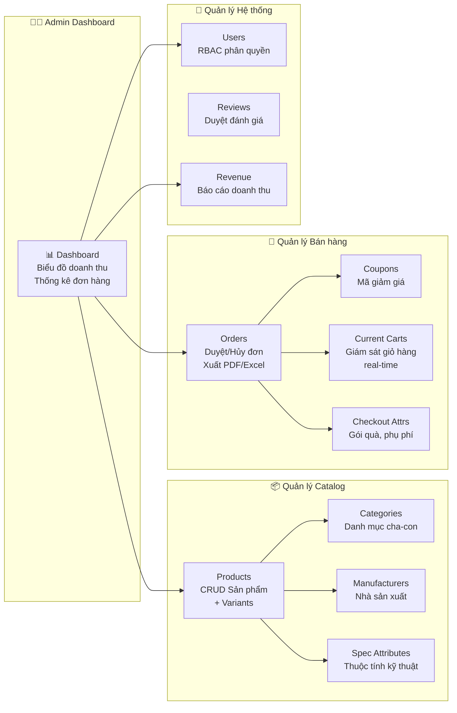
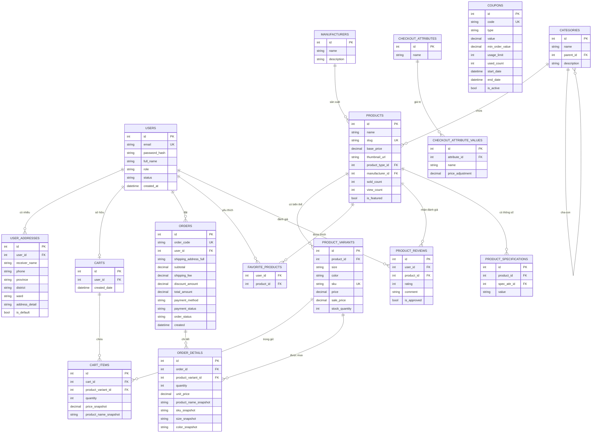
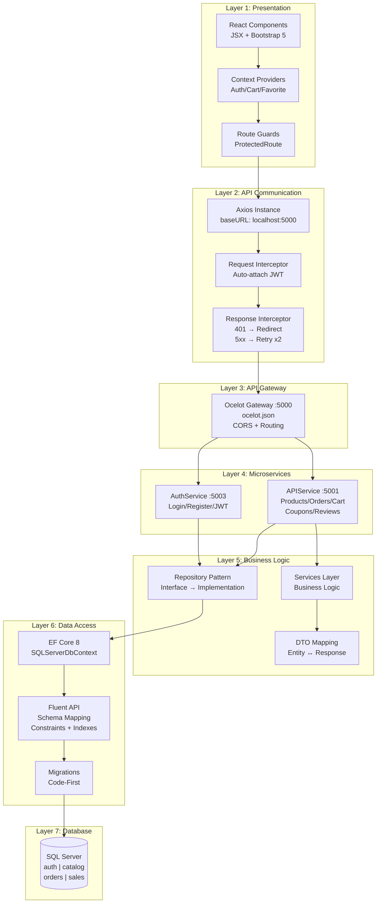

# 🗺️ Sơ đồ Luồng Toàn bộ Hệ thống BaseCore E-Commerce

---

## 1. Kiến trúc Tổng quan Hệ thống

---

## 2. Luồng Xác thực & Phân quyền (JWT + RBAC)

---

## 3. Luồng Mua hàng & Đặt hàng (Cart → Checkout → Order)

---

## 4. Luồng Thanh toán & Xử lý Đơn hàng

---

## 5. Luồng Đổi trả Sản phẩm (RMA Flow)

---

## 6. Luồng Quản trị Admin (Admin Dashboard)

---

## 7. Sơ đồ Quan hệ Database (ER Diagram)

---

## 8. Luồng Dữ liệu End-to-End (Data Flow)

---

> [!TIP]
> Các diagram trên sử dụng cú pháp **Mermaid** — có thể render trực tiếp trên GitHub, GitLab, Notion, hoặc các Markdown viewer hỗ trợ Mermaid.
